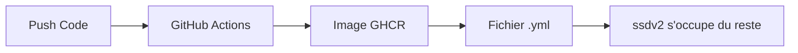

# QBittorrent Error Monitor pour ssdv2

🚀 **Monitor automatique des erreurs qBittorrent avec intégration Sonarr/Radarr pour environnements ssdv2**

[](https://github.com/kesurof/QBittorrent-Error-Monitor/actions)
[](https://github.com/kesurof/QBittorrent-Error-Monitor/pkgs/container/qbittorrent-error-monitor%2Fqbittorrent-monitor)

## 🎯 **Fonctionnalités principales**

### 🔍 **Monitoring intelligent**
- **Détection automatique** des erreurs qBittorrent en temps réel
- **Surveillance continue** des logs et états des torrents
- **Patterns d'erreur configurables** (timeout, DNS, tracker, ratio...)
- **Auto-découverte** des conteneurs qBittorrent, Sonarr, Radarr

### 🛠️ **Actions automatiques**
- **Suppression intelligente** des téléchargements échoués
- **Blacklist automatique** pour éviter les re-téléchargements
- **Déclenchement immédiat** de nouvelles recherches Sonarr/Radarr
- **Notifications** optionnelles (logs détaillés)

### 🐳 **Intégration ssdv2**
- **Compatible natif** avec l'environnement ssdv2
- **Auto-configuration** complète au démarrage
- **Respect des permissions** PUID/PGID
- **Réseau traefik_proxy** intégré
- **Health check** intégré (port 8080)

### 📊 **Monitoring et debug**
- **Logs structurés** avec niveaux configurables
- **Métriques de performance** 
- **Mode test** et **dry-run** pour validation
- **Interface health check** pour supervision

## 🐳 **Image Docker**

```yaml
# Image automatiquement construite et publiée via GitHub Actions
# Multi-architecture : AMD64, ARM64, ARM v7
image: 'ghcr.io/kesurof/qbittorrent-error-monitor/qbittorrent-monitor:ssdv2'
```

> 💡 **Aucune construction locale nécessaire !** L'image est automatiquement disponible sur GitHub Container Registry.

## 📁 **Installation ssdv2**

### **🚀 Application autonome - Compatible ssdv2**

**L'application est autonome et s'auto-configure.** ssdv2 s'occupe du déploiement.

**Étape unique : Copier le fichier d'exemple**

```bash
# Télécharger le fichier d'exemple
wget -O qbittorrent-monitor.yml https://raw.githubusercontent.com/kesurof/QBittorrent-Error-Monitor/main/qbittorrent-monitor.yml
```

**Puis l'intégrer dans votre configuration ssdv2 habituelle.**

> ✅ **C'est tout !** L'application détecte automatiquement les conteneurs qBittorrent, Sonarr, Radarr et s'auto-configure.

## 🔄 **Flux simplifié**



1. **Push code** → GitHub Actions build l'image
2. **Image disponible** sur GHCR  
3. **Utilisateur** télécharge le fichier `.yml` d'exemple
4. **ssdv2** déploie selon sa configuration
5. **Application** s'auto-configure au démarrage

## ⚙️ **Configuration avancée**

### **Variables d'environnement ssdv2**

```yaml
environment:
  # Variables ssdv2 standards
  - PUID=${PUID}                    # ID utilisateur
  - PGID=${PGID}                    # ID groupe  
  - TZ=${TZ}                        # Fuseau horaire
  
  # Configuration application
  - CHECK_INTERVAL=300              # Intervalle vérification (sec)
  - LOG_LEVEL=INFO                  # DEBUG|INFO|WARNING|ERROR
  - DRY_RUN=false                   # Mode simulation
  - DOCKER_NETWORK=traefik_proxy    # Réseau Docker
```

### **Personnalisation des patterns d'erreur**

```yaml
# Éditez config/config.yaml après le premier démarrage
error_patterns:
  connection_errors:
    - "Connection timed out"
    - "No such host is known"
    - "Name resolution failed"
  
  tracker_errors:
    - "Tracker error"
    - "Announce failed"
    - "Unregistered torrent"
  
  file_errors:
    - "No space left on device"
    - "Permission denied"
    - "Disk full"
```

## 📂 **Structure des fichiers (auto-créée)**

```bash
# ssdv2 crée automatiquement
${USERDIR}/docker/qbittorrent-monitor/
├── config/
│   ├── config.yaml              # Configuration auto-générée
│   └── discovered_services.json # Services détectés
└── logs/
    └── qbittorrent-monitor.log  # Logs application
```

## 🔧 **Commandes utiles**

### **Monitoring en temps réel**

```bash
# Logs du conteneur
docker logs -f qbittorrent-monitor

# Logs de l'application
tail -f /settings/storage/docker/USER/qbittorrent-monitor/logs/qbittorrent-monitor.log

# Status détaillé
docker inspect qbittorrent-monitor | grep -A 10 "Health"
```

### **Tests et debug**

```bash
# Test de configuration
docker exec qbittorrent-monitor python3 /app/qbittorrent-monitor.py --health-check

# Mode test (un cycle seulement)
docker exec qbittorrent-monitor python3 /app/qbittorrent-monitor.py --test

# Mode dry-run (simulation)
docker exec qbittorrent-monitor python3 /app/qbittorrent-monitor.py --dry-run --test
```

### **Gestion du service**

```bash
# Redémarrage
docker restart qbittorrent-monitor

# Reconfiguration
docker exec qbittorrent-monitor python3 /app/qbittorrent-monitor.py --config /app/config/config.yaml

# Vérification health check
curl -f http://localhost:8080/health || echo "Service KO"
```

## 🏗️ **Architecture & Développement**

### **🔄 CI/CD Pipeline**
- **GitHub Actions** : Build automatique multi-architecture à chaque push
- **GitHub Container Registry** : Stockage et distribution des images
- **Multi-arch** : Support AMD64, ARM64, ARM v7
- **Tags** : `latest`, `ssdv2`, version git SHA

### **🛠️ Scripts et fichiers**

| Fichier | Usage | Description |
|---------|-------|-------------|
| `qbittorrent-monitor.yml` | **Exemple ssdv2** | Fichier de configuration d'exemple |
| `deploy-ghcr.sh` | **Plan B** | Build manuel si GitHub Actions indisponible |
| `.github/workflows/docker.yml` | **CI/CD** | Pipeline automatique |

> 💡 **Principe** : Application autonome + Fichier d'exemple → ssdv2 fait le reste

## 🔗 **Ressources et liens**

- 📚 [Documentation ssdv2](https://github.com/saltyorg/Saltbox)
- 🔧 [qBittorrent WebUI API](https://github.com/qbittorrent/qBittorrent/wiki/WebUI-API)
- 📡 [Sonarr API Documentation](https://sonarr.tv/docs/api/)
- 🎬 [Radarr API Documentation](https://radarr.video/docs/api/)
- 🐳 [GitHub Container Registry](https://github.com/kesurof/QBittorrent-Error-Monitor/pkgs/container/qbittorrent-error-monitor%2Fqbittorrent-monitor)

## 📄 **Licence**

MIT License - Voir le fichier [LICENSE](LICENSE)

---

**🎯 Spécialement optimisé pour ssdv2 • 🐳 Docker natif • 🤖 CI/CD GitHub Actions**
