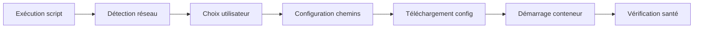
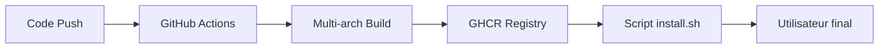

# QBittorrent Error Monitor

🚀 **Monitor automatique des erreurs qBittorrent avec intégration Sonarr/Radarr**

[](https://github.com/kesurof/QBittorrent-Error-Monitor/actions)
[](https://github.com/kesurof/QBittorrent-Error-Monitor/pkgs/container/qbittorrent-error-monitor%2Fqbittorrent-monitor)

## 🎯 **Fonctionnalités principales**

### 🔍 **Monitoring intelligent**
- **Détection automatique** des erreurs qBittorrent en temps réel
- **Surveillance continue** des logs et états des torrents
- **Patterns d'erreur configurables** (timeout, DNS, tracker, ratio...)
- **Auto-découverte** des conteneurs qBittorrent, Sonarr, Radarr

### 🛠️ **Actions automatiques**
- **Suppression intelligente** des téléchargements échoués
- **Blacklist automatique** pour éviter les re-téléchargements
- **Déclenchement immédiat** de nouvelles recherches Sonarr/Radarr
- **Notifications** optionnelles (logs détaillés)

### 🐳 **Intégration Docker**
- **Image pré-construite** sur GitHub Container Registry
- **Auto-configuration** complète au démarrage
- **Permissions** PUID/PGID configurables
- **Health check** intégré (port 8080)
- **Multi-architecture** : AMD64, ARM64, ARM v7

### 📊 **Monitoring et debug**
- **Logs structurés** avec niveaux configurables
- **Métriques de performance** 
- **Mode test** et **dry-run** pour validation
- **Interface health check** pour supervision

## 📁 **Installation**

> 💡 **Aucune construction locale nécessaire !** L'image est automatiquement disponible sur GitHub Container Registry.

### **🚀 Installation rapide (recommandée)**

```bash
# Installation interactive avec choix du réseau et des chemins
curl -sSL https://raw.githubusercontent.com/kesurof/QBittorrent-Error-Monitor/main/install.sh | bash
```

**Fonctionnalités du script d'installation :**
- 🌐 **Sélection interactive du réseau Docker** (bridge, traefik_proxy, docker_default, personnalisé)
- 📂 **Configuration automatique des chemins** (seedbox, local, personnalisé)
- 🔧 **Gestion des permissions** avec sudo si nécessaire
- 🛡️ **Gestion d'erreurs robuste** (fallback, restauration)
- ✅ **Vérifications de santé** automatiques

### **📋 Choix du réseau Docker**

Lors de l'installation, vous pourrez choisir le réseau Docker :

- **1. bridge** (défaut Docker) - Pour usage basique
- **2. traefik_proxy** - Pour intégration Traefik 
- **3. docker_default** - Pour stack Docker Compose
- **4. Personnalisé** - Votre réseau spécifique

> 💡 **Important** : Choisissez le même réseau que vos conteneurs Sonarr/Radarr/qBittorrent pour qu'ils puissent communiquer.

### **📂 Configuration des chemins**

Le script détecte automatiquement votre environnement :

- **1. Seedbox standard** : `/home/USER/seedbox/docker/USER/` (auto-détecté)
- **2. Docker Compose local** : `./data`
- **3. Personnalisé** : Votre chemin spécifique

### **⚙️ Installation manuelle**

```bash
# Créer les répertoires
mkdir -p ~/qbittorrent-monitor/{config,logs}

# Télécharger la configuration
curl -sSL -o ~/qbittorrent-monitor/config/config.yaml \
    https://raw.githubusercontent.com/kesurof/QBittorrent-Error-Monitor/main/config/config.yaml

# Démarrer le conteneur
docker run -d \
  --name qbittorrent-monitor \
  --restart unless-stopped \
  --network bridge \
  -e PUID=$(id -u) \
  -e PGID=$(id -g) \
  -e TZ=Europe/Paris \
  -v ~/qbittorrent-monitor/config:/config:rw \
  -v ~/qbittorrent-monitor/logs:/config/logs:rw \
  -v /var/run/docker.sock:/var/run/docker.sock:ro \
  -v /path/to/your/configs:/configs:ro \
  -p 8080:8080 \
  ghcr.io/kesurof/qbittorrent-error-monitor/qbittorrent-monitor:latest
```

> ⚠️ **Note** : Remplacez `/path/to/your/configs` par le chemin réel vers vos configurations Sonarr/Radarr

## 🔄 **Flux d'installation simplifié**



1. **Script d'installation** → Détection automatique de l'environnement
2. **Choix utilisateur** → Réseau et chemins de configuration
3. **Auto-configuration** → Téléchargement et adaptation de la config
4. **Démarrage** → Conteneur lancé avec les bons paramètres
5. **Vérification** → Health check et validation du fonctionnement

## ⚙️ **Configuration**

### **Variables d'environnement**

```bash
# Variables principales
PUID=1000                    # ID utilisateur
PGID=1000                    # ID groupe  
TZ=Europe/Paris              # Fuseau horaire

# Configuration application
CHECK_INTERVAL=300           # Intervalle vérification (sec)
LOG_LEVEL=INFO              # DEBUG|INFO|WARNING|ERROR
DRY_RUN=false               # Mode simulation
HTTP_PORT=8080              # Port health check
```

### **Structure de configuration attendue**

```bash
# Structure automatiquement créée
~/qbittorrent-monitor/
├── config/
│   └── config.yaml              # Configuration principale
└── logs/
    └── qbittorrent-monitor.log  # Logs application

# Structure des configurations externes
/path/to/configs/
├── sonarr/
│   └── config/
│       └── config.xml           # Configuration Sonarr
└── radarr/
    └── config/
        └── config.xml           # Configuration Radarr
```

### **Personnalisation des patterns d'erreur**

```yaml
# Éditez ~/qbittorrent-monitor/config/config.yaml après le premier démarrage
error_patterns:
  connection_errors:
    - "Connection timed out"
    - "No such host is known"
    - "Name resolution failed"
  
  tracker_errors:
    - "Tracker error"
    - "Announce failed"
    - "Unregistered torrent"
  
  file_errors:
    - "No space left on device"
    - "Permission denied"
    - "Disk full"
```

## 🔧 **Commandes utiles**

### **Monitoring en temps réel**

```bash
# Logs du conteneur
docker logs -f qbittorrent-monitor

# Logs de l'application
tail -f ~/qbittorrent-monitor/logs/qbittorrent-monitor.log

# Status du conteneur
docker ps | grep qbittorrent-monitor

# Health check
curl -f http://localhost:8080/health || echo "Service KO"
```

### **Tests et debug**

```bash
# Test de configuration
docker exec qbittorrent-monitor python3 /app/qbittorrent-monitor.py --health-check

# Mode test (un cycle seulement)
docker exec qbittorrent-monitor python3 /app/qbittorrent-monitor.py --test

# Mode dry-run (simulation)
docker exec qbittorrent-monitor python3 /app/qbittorrent-monitor.py --dry-run --test
```

### **Gestion du service**

```bash
# Redémarrage
docker restart qbittorrent-monitor

# Arrêt
docker stop qbittorrent-monitor

# Suppression complète
docker stop qbittorrent-monitor
docker rm qbittorrent-monitor

# Réinstallation propre
curl -sSL https://raw.githubusercontent.com/kesurof/QBittorrent-Error-Monitor/main/install.sh | bash
```

## 🔧 **Dépannage**

### **Problèmes courants**

#### **1. Erreur de permissions lors de l'installation**
```bash
# Le script gère automatiquement les permissions avec sudo
# Si problème persistant, vérifiez :
ls -la ~/qbittorrent-monitor/
sudo chown -R $(whoami):$(whoami) ~/qbittorrent-monitor/
```

#### **2. Conteneur qui ne démarre pas**
```bash
# Vérifier les logs
docker logs qbittorrent-monitor

# Vérifier la configuration
cat ~/qbittorrent-monitor/config/config.yaml

# Redémarrer avec debug
docker run --rm -it \
  -v ~/qbittorrent-monitor/config:/config:rw \
  ghcr.io/kesurof/qbittorrent-error-monitor/qbittorrent-monitor:latest \
  python3 /app/qbittorrent-monitor.py --test
```

#### **3. Problèmes de réseau Docker**
```bash
# Lister les réseaux disponibles
docker network ls

# Vérifier que les conteneurs sont sur le même réseau
docker network inspect NETWORK_NAME

# Redémarrer avec le bon réseau
docker stop qbittorrent-monitor
docker rm qbittorrent-monitor
# Relancer l'installation avec le bon réseau
```

#### **4. Applications non détectées**
```bash
# Vérifier que les chemins de configuration sont corrects
docker exec qbittorrent-monitor ls -la /configs/
docker exec qbittorrent-monitor ls -la /configs/sonarr/config/
docker exec qbittorrent-monitor ls -la /configs/radarr/config/

# Vérifier la configuration
docker exec qbittorrent-monitor cat /config/config.yaml
```

### **Nettoyage complet**

```bash
# Supprimer complètement l'installation
docker stop qbittorrent-monitor 2>/dev/null || true
docker rm qbittorrent-monitor 2>/dev/null || true
rm -rf ~/qbittorrent-monitor/

# Réinstaller proprement
curl -sSL https://raw.githubusercontent.com/kesurof/QBittorrent-Error-Monitor/main/install.sh | bash
```

## 🏗️ **Architecture & Développement**

### **🔄 CI/CD Pipeline**
- **GitHub Actions** : Build automatique multi-architecture à chaque push
- **GitHub Container Registry** : Stockage et distribution des images
- **Multi-arch** : Support AMD64, ARM64, ARM v7
- **Tags** : `latest`, version git SHA

### **🛠️ Structure du projet**

| Fichier | Usage | Description |
|---------|-------|-------------|
| `install.sh` | **✅ RECOMMANDÉ** | Script d'installation unique et robuste |
| `qbittorrent-monitor.py` | **🐍 Application** | Application Python principale |
| `config/config.yaml` | **⚙️ Configuration** | Configuration par défaut |
| `entrypoint.sh` | **🐳 Docker** | Point d'entrée du conteneur |
| `Dockerfile` | **🐳 Image** | Définition de l'image Docker |
| `docker-compose.yml` | **📄 Compose** | Exemple Docker Compose |
| `.github/workflows/docker.yml` | **🤖 CI/CD** | Pipeline automatique |

### **🔄 Flux de développement**



## 🔗 **Ressources et liens**

- 🔧 [qBittorrent WebUI API](https://github.com/qbittorrent/qBittorrent/wiki/WebUI-API)
- 📡 [Sonarr API Documentation](https://sonarr.tv/docs/api/)
- 🎬 [Radarr API Documentation](https://radarr.video/docs/api/)
- 🐳 [GitHub Container Registry](https://github.com/kesurof/QBittorrent-Error-Monitor/pkgs/container/qbittorrent-error-monitor%2Fqbittorrent-monitor)
- 🚀 [GitHub Actions](https://github.com/kesurof/QBittorrent-Error-Monitor/actions)

## 📄 **Licence**

MIT License - Voir le fichier [LICENSE](LICENSE)

---

**🎯 Solution Docker simple et efficace • 🐳 Image pré-construite • 🤖 CI/CD GitHub Actions • 🔧 Installation en une commande**
